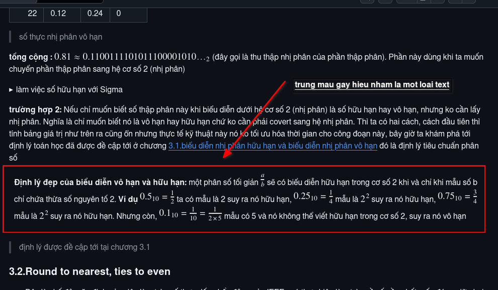
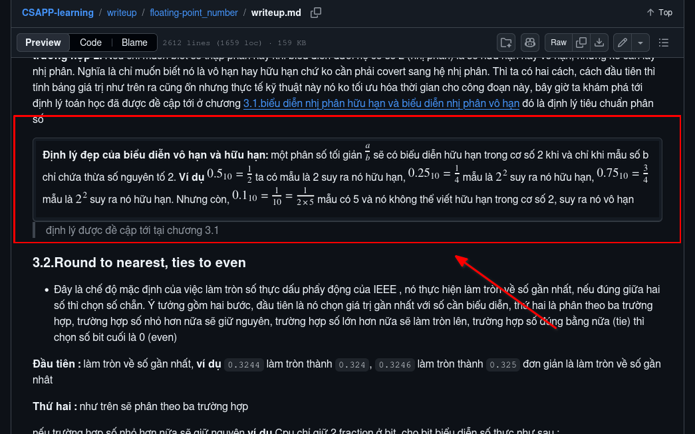

# Writeups-technique
Viết writeups ko chỉ cho người khác đọc mà còn cho chính bản thân mình trong tương lai xem lại khi kiến thức bị bão hòa theo thời gian. Vì vậy, việc nắm vững các kỹ thuật trình bày, phát biểu và tính mạch lạc là điều vô cùng quan trọng

Viết writeup ko chỉ viết văn, nó còn là cả một nghệ thuật của công đoạn học hỏi. Vậy nên nếu biết đặt câu hỏi cho chiều sâu và tính thực dụng của tri thức, thì việc trình bày giúp ta tiếp thu nó tốt hơn

---

## 1.Phần details

Là thứ quan trọng nhất, vấn đề là chúng thu gọn thông tin được truyền đặt vào một khung nhỏ, đọc giả hễ muốn đọc thì cứ việc mở ra và tránh làm nhiễu vấn đề trọng tâm có trong writeup. Nhưng cũng để ý nó còn có một điểm yếu chí mạng, nếu ta chủ quan ko thiết lập ranh giới rõ ràng cho nó, nó có thể gây ra nhầm lẫn rối loạn thông tin (kiểu nó như hòa là một với thông tin trọng tâm) nên việc đặt ranh giới với kỹ thuật `---` bên trên lẫn dưới và `<sub>--đã hết phần giải thích--</sub>` bên dưới cùng phần details khi kết thúc trình bày lại vô cùng quan trọng.

Nó cho biết đọc giả đã nhận thức mình đã thực sự đọc xong phần này chưa, ngoài ra cần thêm `> phần detail trả lời câu hỏi trên` hay `> phần details giải thích về FPU` cho đọc giả biết mình có quan tâm chủ đề này không. Tiếp theo, ta cần tận dụng các thẻ như `<table>, <tr>, <td>` để làm đẹp, góp phần chuyên nghiệp cho phần details này. Bổ sung vào đó là thêm tiền tố cho `summary` ví dụ `<summary><b>[Câu hỏi]</b> Vì sao nó lại vậy...?</summary>` có tiền tố là `[câu hỏi]` và `<b>` là thẻ in đậm, ta có ví dụ:

```
<details>
	<summary><b>[Chi tiết]</b> Cách chuyển đổi số thập phân sang phân số</summary>

<table>
<tr>
<td>

---

Trước tiên về toán học căn bản, ta cần phải nhìn vào số thập phân xem, nó có bao nhiêu chữ số sau dấu phẩy để quyết định phần mẫu là số đơn vị, chục, trăm v.v.. Còn phần tử ta xem giá trị ước chung lớn nhất để suy ra. **Ví dụ** với số `0.25` đầu tiên ta cần phải hiểu, hệ cơ số của số nguyên là `10` trong tin học, tiếp theo như đã nói ta nhìn vào số thập phân ở đây là `0.25` nó có bao nhiêu số sau dấu phẩy, ta thấy nó có 2 số là `25` sau dấu phẩy vậy ta có $$\large10^{2} = 100_{10}$$ và số `10` chính là hệ cơ số của số nguyên

Vậy nên ta có mẫu là `100`, tiếp theo phần `tử` của phân số để biết ta tính ước chung lớn nhất `GCD` ta cần biết phải lấy gì vào ước chung lớn nhất, đó chính là tất cả giá trị ở phần đuôi sau dấu phẩy (ko lấy phàn nguyên) và số giá trị `n(value)`, ở đây ta có tất cả giá trị ở phần đuôi sau dấu phẩy `0.25` là `25` vì giá trị này nằm sau phần đuôi, tới lượt là số giá trị `n(value)` là `100` là cái mà ta nhìn vào phần số thập phân như trên. Vậy ta có `GCD(25,100) = 25`

Nên từ dữ kiện, ta có $$\large10^{2} = 100_{10}$$ cho mẫu và `GCD(25,100) = 25` cho tử thì ta có phân số $$\large\boxed{0.25 = \frac{25}{100}}$$

<sub>--đã hết phần giải thích--</sub>

---

</td>
</tr>
</table>
</details>
```

kết quả là:

<details>
	<summary><b>[Chi tiết]</b> Cách chuyển đổi số thập phân sang phân số</summary>

<table>
<tr>
<td>

---

Trước tiên về toán học căn bản, ta cần phải nhìn vào số thập phân xem, nó có bao nhiêu chữ số sau dấu phẩy để quyết định phần mẫu là số đơn vị, chục, trăm v.v.. Còn phần tử ta xem giá trị ước chung lớn nhất để suy ra. **Ví dụ** với số `0.25` đầu tiên ta cần phải hiểu, hệ cơ số của số nguyên là `10` trong tin học, tiếp theo như đã nói ta nhìn vào số thập phân ở đây là `0.25` nó có bao nhiêu số sau dấu phẩy, ta thấy nó có 2 số là `25` sau dấu phẩy vậy ta có $$\large10^{2} = 100_{10}$$ và số `10` chính là hệ cơ số của số nguyên

Vậy nên ta có mẫu là `100`, tiếp theo phần `tử` của phân số để biết ta tính ước chung lớn nhất `GCD` ta cần biết phải lấy gì vào ước chung lớn nhất, đó chính là tất cả giá trị ở phần đuôi sau dấu phẩy (ko lấy phàn nguyên) và số giá trị `n(value)`, ở đây ta có tất cả giá trị ở phần đuôi sau dấu phẩy `0.25` là `25` vì giá trị này nằm sau phần đuôi, tới lượt là số giá trị `n(value)` là `100` là cái mà ta nhìn vào phần số thập phân như trên. Vậy ta có `GCD(25,100) = 25`

Nên từ dữ kiện, ta có $$\large10^{2} = 100_{10}$$ cho mẫu và `GCD(25,100) = 25` cho tử thì ta có phân số $$\large\boxed{0.25 = \frac{25}{100}}$$

<sub>--đã hết phần giải thích--</sub>

---

</td>
</tr>
</table>
</details>

> [!IMPORTANT]
> Việc dùng thẻ `<table>` cho details thì tốt. Nhưng, nó chỉ nên dùng details đầu tiên. Với các details dạng mà lồng vào details khác thì ko nên dùng thẻ `<table>` vì nếu dùng nó vào các details đã được lồng vào details bên ngoài thì sẽ tạo ra hiệu ứng trượt ngang, nó ko giống xuống dòng text văn bản khi tới hạn đích mà là nó phải trượt sang. Mà, tài liệu vừa đọc vừa trượt ngang gây rất bất tiện cho đọc giả

Ví dụ sai lầm khi dùng thẻ `<table>` cho details lồng :

<details>
	<summary>câu hỏi 1</summary>
<table>
<tr>
<td>

<details>
	<summary>câu hỏi 2</summary>
<table>
<tr>
<td>

> Văn bản được minh họa bởi phần writeup IEEE754

Ta xét $$\large1+2^{-23}$$ và ta đã biết $$\large2^{-1} = \frac{1}{2^{1}} = \frac{1}{2}$$, $$\large2^{-2} = \frac{1}{2^{2}} = \frac{1}{4}$$... Vậy $$\large2^{-23}$$ chính là một bit `1` nằm ở vị trí thứ 23 sau dấu chấm nhị phân. **Ví dụ** $$\large1+2^{-1}=1.1_{2}$$, $$\large1+2^{-2}=1.01_{2}$$, $$\large1+2^{-3}=1.001_{2}$$... (giá trị `1` đằng trước là phần nguyên) vậy tương tự với $$\large1+2^{-23}=\boxed{1.00000000000000000000001_{2}}$$

**Vì sao nó lại liên quan tới 32bit?:** với 32bit (Float) biểu diễn cấu trúc nhị phân của số thực có dạng:

| sign | exponent | fraction |
|-----|----------|----------|
|  1  |    8     |    23    |

Điều quan trọng là `fraction = 23 bit` , Với một số normalized binary32, significand được hiểu là `1.fraction` nghĩa là theo chuẩn hóa thì `hiddenbit = 1` và có 23bit fraction ví dụ binary32 có `fraction = 00000000000000000000001` thì nó sẽ là $$\large\boxed{\mathrm{1}.00000000000000000000001_{2}}$$ và giá trị này đúng y hệt cái ta đang có ở biểu thức $$\large1+2^{-23}$$


Bây giờ tới phần ghép thêm $$\large2^{-24}$$, như đã nói phần gía trị `-24` đã được cho ở chuỗi `0x1.000002p-24f` (phần `p-24`) trước đó ta ghép lại thành $$\large(1 + 2^{-23})2^{-24}$$ cái này chỉ đơn giản là làm đúng dạng normalized theo như công thức ở chương [1.Tổng quan về IEEE 754](#1tổng-quan-về-ieee-754) là $$\large(-1)^{S}\times1.m\times2^{e - b}$$ với significand = $$\large1.00000000000000000000001_{2}$$ và actual exponent = -24

**điều dễ nhầm là :** `-24` không làm significand dài thêm. Nó chỉ làm là lấy significand này rồi dịch dấu chấm nhị phân 24 vị trí sang trái và phần này vừa khít với 1 hidden bit + 23 fraction bits
</td>
</tr>
</table>
</details>

Ta thấy details lồng bị hiệu ứng trượt ngang gây bất tiện cho người đoc 

</td>
</tr>
</table>
</details>

---

## 2.Nghệ thuật đặt ranh giới cho các chủ đề

khi mục lục được thiết lập sẵn, nhưng với các chủ đề như `## 1.tổng quan mã bù hai` và `## 2.nghệ thuật khử nhiễu trong dịch ngược` cần phải cách ly bằng cách thiết lập ranh giới `---` gạch ngang cho từng chủ đề. Đối với chủ đề con như `#### 1.1.Mã bù hai là gì?` thì chúng ta ko cần thiết lập ranh giới, vì nó thuộc chủ đề `## 1` nên việc đặt ranh giới vừa phá vỡ trình tự logic, vừa tăng rối mắt cho đọc giả

---

## 3.Nghệ thuật thiết lập mục lục

mục lục thoáng qua hơi tầm thường, nhưng với sách hay tài liệu giá trị cao thường rất hay dùng. Có mục lục, đọc giả biết trang thông tin này nó có những điều gì, điều gì mình cần học và mình học được những gì trong này. Mục lục hay, đọc giả siêu lòng có hứng đọc tiếp, mục lục tầm thường đọc giả bỏ qua bài luôn.

trình bày rõ và khoảng cách với các mục con của mục chính, ví dụ :

```
- 1.Tổng quan về IEEE754
    - 1.1.IEEE754 là gì
      - 1.1.1.<thông tin tiếp>
```

tac dụng của nó sẽ giúp đọc giả phân biệt phần nào là phần con thuộc phần cha, tránh soi từng số gây tốn time và mỏi mắt. Quan trọng ko kém là đính kèm link redirect vào trong mục lục luôn, họ ấn là dịch tới chính xác cái họ cần, khỏi phải lướt tay tìm kiếm tốn thời gian

---

## 4.Nghệ thuật reading checkpoint

Writeup tốt ko chỉ cho đọc giả biết ranh giới và phân biệt của tầng thông tin vật lý, nó cần phải cho đọc giả biết ranh giới và nhìn thấu nhận thức của mình hiện tại với kiến thức. Một reading checkpoint có thể giúp đạt sự truyền tải thông tin tốt hơn vì nó cho biết đọc giả cần chuẩn bị những gì trước khi đi qua vấn đề này và học hỏi. Ví dụ :

```
> **Reading checkpoint**
>
> Đến đây, bạn cần hiểu:
>
> - Actual exponent là gì
> - Exponent field là gì
> - Bias dùng để làm gì
> - Chuẩn hóa số thực ra sao
> - Sign là gì
> - số âm, dương actual exponent của vị trí dấu chấm nhị phân
>
> Nếu đã rõ thì có thể tiếp tục.
```

thêm vào trước chủ đề hay ở chỗ người đọc có thể nhìn thấy trước khi đi vào phần introduce của chương kế tiếp.

## 5.Nghệ thuật phép toán học

Dùng các cú pháp phân số, căn bậc, nhân chia, lũy thừa như `$$\large2^{2} = 4` góp phần làm cho tính dễ đọc thăng cao và chuyên nghiệp hơn. Cú pháp toán học phải **TO, Rõ ràng** để thấy, ở đây mình khuyến nghị dùng `\large hay \Large (Muốn to hơn nữa)` trước cú pháp như trên. Ngoài ra, các mũi tên như `2+1 \xrightarrow{\text{thông tin 1}} 3` hay việc đóng khung bên dưới từng biểu thức như `\underbrace{1\times2^{2}}*{\text{thông tin 2}}=\underbrace{1\times2\times2}*{\text{thông tin 2}}` giúp góp thêm không gian nêu rõ các ý nghĩa của biểu thức và trực quan hơn, góp phần giúp mức độ hiểu biết cao hơn và sâu hơn 

ví dụ với `\underbrace{1\times2^{2}}*{\text{thông tin 2}}=\underbrace{1\times2\times2}*{\text{thông tin 2}}` thì sẽ ra thế này :

$$\large
\underbrace{1\times2^{2}}*{\text{thông tin 2}}=
\underbrace{1\times2\times2}*{\text{thông tin 2}}
$$

hay với `\xrightarrow{\text{thông tin 1}}` :

$$\large
2 + 1 \xrightarrow{\text{thông tin 1}} 3
$$

## 6.Nghệ thuật phân bổ tiêu đề theo từng giai cấp

việc phân bổ tiêu đề ít góp phần gì nhiều, nhưng việc nó làm thay đổi kích cỡ cho các tiêu đề cha và con sẽ khiến đọc giả có mạch tự nhiên hơn và sẽ cảm nhận được đây là tiêu đề con theo kích cỡ của chữ, thay vì phải kéo lên mục lục xem lại. Dùng các `#` cho tiêu đề chính, thường giới thiệu ví dụ :

```
# Writeup : chủ đề writeup
```

dùng `##` cho tiêu đề cha ví dụ :

```
## 1.Tổng quan về số thực chuẩn IEEE754
```

dùng `###` cho tiêu đề con ví dụ :

```
### 1.1.IEEE754 là gì?
```

dùng `####` cho tiêu đề cháu, ví dụ :

```
#### 1.1.1.Các vấn đề thường gặp phải trong IEEE754
```

Khuyến nghị nên dùng `#` tới `####` cho từng tiêu đề, vì nếu dùng nhiều hơn kích cỡ sẽ rất nhỏ gây khó khăn cho người đọc

## 7.Nghệ thuật phân mảnh văn phong dài

dùng nút enter để xuống dòng theo nhịp của các đoạn văn dài, ví dụ từ đoạn sau :

```
- không phải mọi số thập phân đều biểu diễn chính xác trong nhị phân, nên IEEE 754 phải làm tròn (rounding). Đây là nguyên nhân của những kết quả như `0.1 + 0.2 != 0.3` trong nhiều ngôn ngữ lập trình. Phần chương này sẽ biểu diễn và tổng quát về việc này. Vì sao lại phải rounding?: Trong hệ thống máy tính, bit nhị phân là hữu hạn nhưng biểu diễn số thực một cách chính xác lại phải vô hạn nên khi đến một ngưỡng nào đó đụng tới rào cản hữu hạn sẽ xem như làm tròn của bit nhị phân đó ví dụ 4 bit $$\large0000_{2}$$ thì số thực chỉ được biểu diễn ở phạm vi bit này, bit được cấp cho trường fraction và các trường khác lại rất ít nên độ chính xác vì thế mà giảm rất đáng kể
```

ta có thể xuống dòng thành như vậy :

```
- không phải mọi số thập phân đều biểu diễn chính xác trong nhị phân, nên IEEE 754 phải làm tròn (rounding). Đây là nguyên nhân của những kết quả như `0.1 + 0.2 != 0.3` trong nhiều ngôn ngữ lập trình. Phần chương này sẽ biểu diễn và tổng quát về việc này

**Vì sao lại phải rounding?:** Trong hệ thống máy tính, bit nhị phân là hữu hạn nhưng biểu diễn số thực một cách chính xác lại phải vô hạn nên khi đến một ngưỡng nào đó đụng tới rào cản hữu hạn sẽ xem như làm tròn của bit nhị phân đó ví dụ 4 bit $$\large0000_{2}$$ thì số thực chỉ được biểu diễn ở phạm vi bit này, bit được cấp cho trường fraction và các trường khác lại rất ít nên độ chính xác vì thế mà giảm rất đáng kể
```

điều này giúp người đọc đỡ ngộp hơn

## 8.Nghệ thuật chèn các ký hiệu đặc biệt vào mục tiêu đề (mục lục)

Ta găp vấn đề khi dùng `$$\large1_{2}$$` nó lại hiện nguyên hình cú pháp khi đóng khung như `[ ]` để index link redirect vào? , ko sao ta có cách giải quyết là ta cần push lên github hay các nền tảng gì để nó in ra và ta copy nó dán vào là xong. Chỉ có thể dùng và hoạt động với một số kiểu nhất định như dương vô cực, âm vô cực $$\large+\infty$$, $$\large-\infty$$ ...

ví dụ :

```
[3.4.Round toward positive infinity $$\large+\infty$$]() // bị hiện nguyên cú pháp $$\large+\infty$$

thay vào đó, copy ký hiệu luôn

[3.4.Round toward positive infinity +∞]() //ổn thỏa, redirect link thoải mái
```

## 9.Khuôn viền và mô tả hình ảnh

Nghệ thuật này rất hữu ích, ví dụ trường hợp khi các ảnh trùng màu nền. Chẳng hạn, khi ta chụp màn hình ảnh nền của github để lấy cái thông tin quan trọng cho đọc giả đỡ phải bấm link redirect quay lại gây bất tiện, nhưng vấn đề màu nền github hay các màu nền trùng rất cao khiến 90% đọc giả phải hiểu nhầm đó là một loại văn bản ví dụ cụ thể:

```

> định lý được đề cập tới tại chương 3.1
```

thì kết quả sẽ ra

<kbd>
    


</kbd>

> ta thấy nó bị trùng màu

Để khắc phục điều này, ta dùng thẻ `<kbd> </kbd>` để tao viền nhẹ, vừa đẹp vừa chuyên nghiệp hoặc dùng các viền đỏ ở các trình edit ảnh sẽ có thể, nhưng ko đẹp bằng `<kbd` điều này thường được dùng phổ biến hơn:

```
<kbd>


</kbd>


> định lý được đề cập tới tại chương 3.1
```

<kbd>
    


</kbd>

> khử trùng màu hòan tất

ta thấy đẹp và chuyên nghiệp hơn bao giờ hết. Tiếp theo là mô tả hình ảnh, nhiều writer thường dùng `` dùng mô tả `alt text`, hay các mô tả lặp lại từ các document hướng dẫn chèn ảnh markdown. Ừm, điều này ko phải vấn đề lớn khi ta viết và show trên github, nhưng nếu chuyển sang PDF hay các tài liệu định dạng khác thì điều này là một vấn đề lớn, vì nó hiện các mô tả đó dưới hình ảnh. Nhưng việc tốn chút time để viết các mô tả góp phần chuyên nghiệp và nghiêm túc, rõ ràng hơn. Ví dụ thay vì `` thì nên `` hoặc thay vì `` thì nên ``


Hơn nữa, đây cũng là phần góp quan trọng. Ta cần phải phân bố cục của hình ảnh theo quy ước thẩm mỹ và ưa nhìn nhất, nếu ta cấu hình ảnh bên trái thì bên phải ta cần bổ sung một lượng thông tin, ví dụ có thể mô tả, research hay là kiến thức v.v.. với cách này cần phải đi với thẻ `<table>` để có thể đưa thông tin vào. Ví dụ như sau :

```
<table>

<td width="40%" align="right">
<kbd>
	
</kbd>
</td>

<td align="top">

đây là minh họa hình ảnh, hình ảnh này lưu một đoạn của một bài writeup IEEE754 để cải tiến khả năng viết và trình bày

</td>

</table>
```

Kết quả:

<table>

<td width="40%" align="right">
	
</td>

<td align="top">

đây là minh họa hình ảnh, hình ảnh này lưu một đoạn của một bài writeup IEEE754 để cải tiến khả năng viết và trình bày

</td>

</table>

## 10.Bản tính quá dài, và rút gọn nó

Nghệ thuật này giải quyêt và cải tiến phong cách trình bày bản tính ví dụ:

```
| Bước | Giá trị | x2   | Bit lấy |
| ---: | ------- | ---- | ------- |
|    1 | 0.81    | 1.62 | 1       |
|    2 | 0.62    | 1.24 | 1       |
|    3 | 0.24    | 0.48 | 0       |
|    4 | 0.48    | 0.96 | 0       |
|    5 | 0.96    | 1.92 | 1       |
|    6 | 0.92    | 1.84  | 1     |
| 7 | 0.84 | 1.68 | 1 |
| 8 | 0.68 | 1.36 | 1 |
| 9 | 0.36 | 0.72 | 0 |
| 10 | 0.72 | 1.44 | 1 |
| 11 | 0.44 | 0.88 | 0 |
| 12 | 0.88 | 1.76 | 1 |
| 13 | 0.76 | 1.52 | 1 |
| 14 | 0.52 | 1.04 | 1 |
| 15 | 0.04 | 0.08 | 0 |
| 16 | 0.08 | 0.16 | 0 |
| 17 | 0.16 | 0.32 | 0 |
| 18 | 0.32 | 0.64 | 0 |
| 19 | 0.64 | 1.28 | 1 |
| 20 | 0.28 | 0.56 | 0 |
| 21 | 0.56 | 1.12 | 1 |
| 22 | 0.12 | 0.24 | 0 |

> số thực nhị phân vô hạn
```

kết quả sẽ là :

| Bước | Giá trị | x2   | Bit lấy |
| ---: | ------- | ---- | ------- |
|    1 | 0.81    | 1.62 | 1       |
|    2 | 0.62    | 1.24 | 1       |
|    3 | 0.24    | 0.48 | 0       |
|    4 | 0.48    | 0.96 | 0       |
|    5 | 0.96    | 1.92 | 1       |
|    6 | 0.92    | 1.84  | 1     |
| 7 | 0.84 | 1.68 | 1 |
| 8 | 0.68 | 1.36 | 1 |
| 9 | 0.36 | 0.72 | 0 |
| 10 | 0.72 | 1.44 | 1 |
| 11 | 0.44 | 0.88 | 0 |
| 12 | 0.88 | 1.76 | 1 |
| 13 | 0.76 | 1.52 | 1 |
| 14 | 0.52 | 1.04 | 1 |
| 15 | 0.04 | 0.08 | 0 |
| 16 | 0.08 | 0.16 | 0 |
| 17 | 0.16 | 0.32 | 0 |
| 18 | 0.32 | 0.64 | 0 |
| 19 | 0.64 | 1.28 | 1 |
| 20 | 0.28 | 0.56 | 0 |
| 21 | 0.56 | 1.12 | 1 |
| 22 | 0.12 | 0.24 | 0 |

> số thực nhị phân vô hạn

Nó rất dài gây bất tiện cho đọc giả, cách chuyên nghiệp hơn là dùng thẻ `<table>, <td>, <tr>` ví dụ:

```
<table>
<tr>
<td>

| Bước | Giá trị | x2   | Bit lấy |
| ---: | ------- | ---- | ------- |
|    1 | 0.81    | 1.62 | 1       |
|    2 | 0.62    | 1.24 | 1       |
|    3 | 0.24    | 0.48 | 0       |
|    4 | 0.48    | 0.96 | 0       |
|    5 | 0.96    | 1.92 | 1       |
|    6 | 0.92    | 1.84  | 1     |
| 7 | 0.84 | 1.68 | 1 |
| 8 | 0.68 | 1.36 | 1 |
| 9 | 0.36 | 0.72 | 0 |
| 10 | 0.72 | 1.44 | 1 |
| 11 | 0.44 | 0.88 | 0 |

</td>
<td>

| Bước | Giá trị | x2   | Bit lấy |
| ---: | ------- | ---- | ------- |
| 12 | 0.88 | 1.76 | 1 |
| 13 | 0.76 | 1.52 | 1 |
| 14 | 0.52 | 1.04 | 1 |
| 15 | 0.04 | 0.08 | 0 |
| 16 | 0.08 | 0.16 | 0 |
| 17 | 0.16 | 0.32 | 0 |
| 18 | 0.32 | 0.64 | 0 |
| 19 | 0.64 | 1.28 | 1 |
| 20 | 0.28 | 0.56 | 0 |
| 21 | 0.56 | 1.12 | 1 |
| 22 | 0.12 | 0.24 | 0 |

</td>
</tr>
</table>

> số thực nhị phân vô hạn
```

kết quả :

<table>
<tr>
<td>

| Bước | Giá trị | x2   | Bit lấy |
| ---: | ------- | ---- | ------- |
|    1 | 0.81    | 1.62 | 1       |
|    2 | 0.62    | 1.24 | 1       |
|    3 | 0.24    | 0.48 | 0       |
|    4 | 0.48    | 0.96 | 0       |
|    5 | 0.96    | 1.92 | 1       |
|    6 | 0.92    | 1.84  | 1     |
| 7 | 0.84 | 1.68 | 1 |
| 8 | 0.68 | 1.36 | 1 |
| 9 | 0.36 | 0.72 | 0 |
| 10 | 0.72 | 1.44 | 1 |
| 11 | 0.44 | 0.88 | 0 |

</td>
<td>

| Bước | Giá trị | x2   | Bit lấy |
| ---: | ------- | ---- | ------- |
| 12 | 0.88 | 1.76 | 1 |
| 13 | 0.76 | 1.52 | 1 |
| 14 | 0.52 | 1.04 | 1 |
| 15 | 0.04 | 0.08 | 0 |
| 16 | 0.08 | 0.16 | 0 |
| 17 | 0.16 | 0.32 | 0 |
| 18 | 0.32 | 0.64 | 0 |
| 19 | 0.64 | 1.28 | 1 |
| 20 | 0.28 | 0.56 | 0 |
| 21 | 0.56 | 1.12 | 1 |
| 22 | 0.12 | 0.24 | 0 |

</td>
</tr>
</table>

> số thực nhị phân vô hạn

chuyên nghiệp hơn và dễ nhìn hơn, đở phải lướt xuống.
